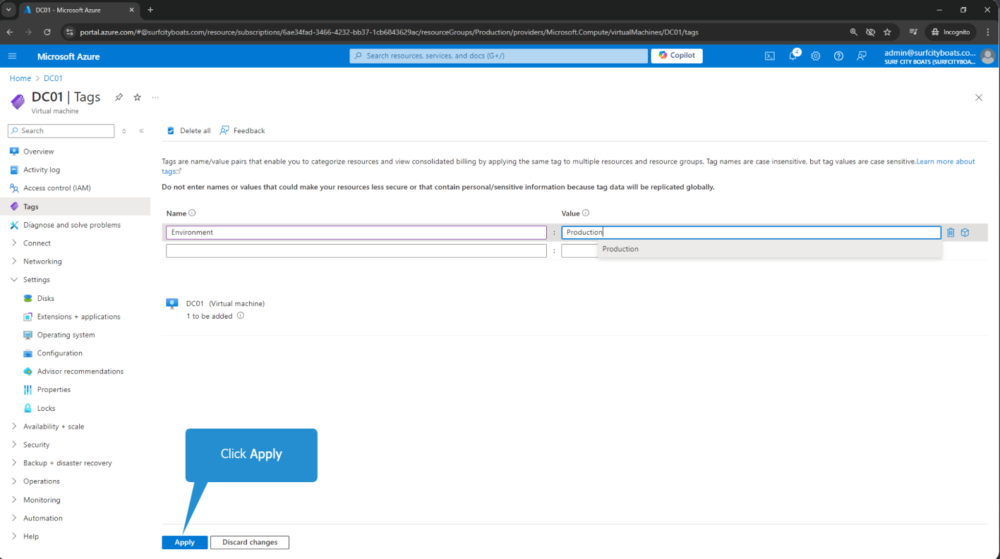

# Azure Tags Lab 
In this lab, I demonstrate how to effectively tag resources in Microsoft Azure to improve the organization and management of cloud infrastructure. I use tagging to assign metadata—such as environment, department, or cost center—to resources like virtual machines, making it easier to track and categorize them.

Through a step-by-step process, I apply meaningful tags across multiple resources and use Azure’s filtering tools to display and manage assets based on their assigned tags. This lab showcases how I implement and utilize tags to enhance visibility, governance, and operational clarity within Azure.

## 🎯 Lab Objectives – Azure Tags Lab
- I explored the importance of tagging resources in Microsoft Azure to improve organization and streamline infrastructure management.

- I applied tags to Azure resources—such as virtual machines—using the Azure portal interface.

- I gained hands-on experience creating and assigning meaningful tags like "Environment" and specifying values such as "Production" and "Development".

- I used tags to filter and view resources based on specific categories, making it easier to manage workloads across my cloud environment.

- I developed practical skills in using Azure’s search functionality to locate resources by their assigned tags, enhancing visibility and operational control.

## 📸Screenshots

###  Step 1: Click DC01  
_Selected the virtual machine “DC01” from the resource list to begin tagging._

### Step 2: Click Tags  
_Navigated to the “Tags” blade from the DC01 virtual machine overview to begin assigning metadata for environment classification._

### Step 3: Click Name field  
_Began the tagging process by clicking into the “Name” field to define the metadata key for the DC01 virtual machine._

### Step 4: Click Value Field  
_Entered the tag value in the “Value” field to complete the metadata pair for the DC01 virtual machine._

###  Step 5: Type Production and press Enter  
_Entered `Production` as the tag value to classify the DC01 virtual machine under the production environment._

### Step 6: Confirm Tag Input
The tooltip prompts to press Enter after typing the value, confirming the tag entry.

### Step 7: Review Tag Summary
The interface shows the tag pair Environment = Development ready to be applied.

### Step 8: Apply Tag
Clicked “Apply” to save the tag to the WEB01 VM, making it part of the resource metadata.

### Step 9: Validate Tag Assignment
Confirmed that the tag was successfully added and now appears in the resource’s tag list.

### Step 10: Repeat for Other Resources
Prepared to replicate tagging across other VMs and resources for consistent metadata management.

###  Step 11: Click Apply  
_Saved the tag `Environment = Development` to the WEB01 virtual machine by clicking “Apply,” finalizing the metadata assignment._

### Step 12: Click Home  
_Returned to the Azure portal homepage by clicking “Home,” preparing to view and filter resources by tag._

### Step 13: Click search box  
_Used the Azure portal’s search bar to locate resources, services, or documentation relevant to tagging and virtual machine management._

### Step 14: Type tags and press enter  
_Used the Azure portal’s search bar to locate the Tags blade by typing “tags” and pressing Enter, streamlining navigation to resource metadata._

### Step 15: Click Tags  
_Selected the “Tags” option from the search results to open the tagging interface and begin resource categorization._

###  Step 16: Click Environment: Development  
_Selected the tag `Environment: Development` to filter and view resources categorized under the development environment._

###  Step 17: Click Environment: Production  
_Switched the tag filter to `Environment: Production` to view resources categorized under the production environment._

### Step 18: Click Home  
_Returned to the Azure portal homepage by clicking “Home,” resetting the view after filtering resources by the `Environment: Production` tag._

